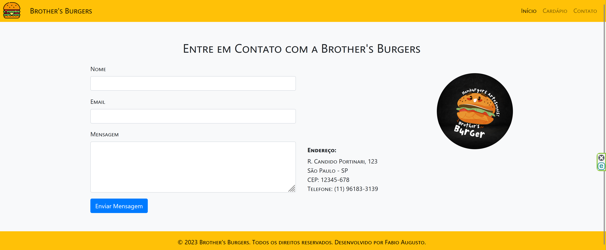

# CardapioOnline (CardapioWebFacil)!

O sistema web oferece um cardápio completo com carrinho de compras integrado, permitindo aos clientes enviar pedidos diretamente para o WhatsApp. Isso simplifica o processo de compra, agiliza o atendimento e melhora a experiência dos clientes.

## Objetivo

Facilitar o processo de compra e agilizar o atendimento dos clientes por meio de um cardápio online com carrinho de compras integrado, permitindo o envio direto de pedidos para o WhatsApp.

## Diferencial

Além de oferecer um cardápio online com carrinho de compras, nosso sistema se destaca ao permitir o envio direto dos pedidos para o WhatsApp, proporcionando uma comunicação instantânea e conveniente entre o estabelecimento e os clientes, agilizando o processo de atendimento e oferecendo uma experiência personalizada.

## Tecnologias

* PHP
* CSS3
* HTML5
* JS
  
## Status

Concluído

#### **Publicado em:** http://cardapiowebfacil.com.br/

## Telas

  
 |  | 
:-------------------------:|:-------------------------:|:-------------------------:
 |  |
  

**Proibida a distribuição ou revenda desse material.**
